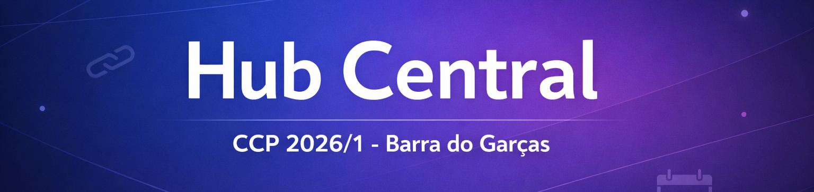
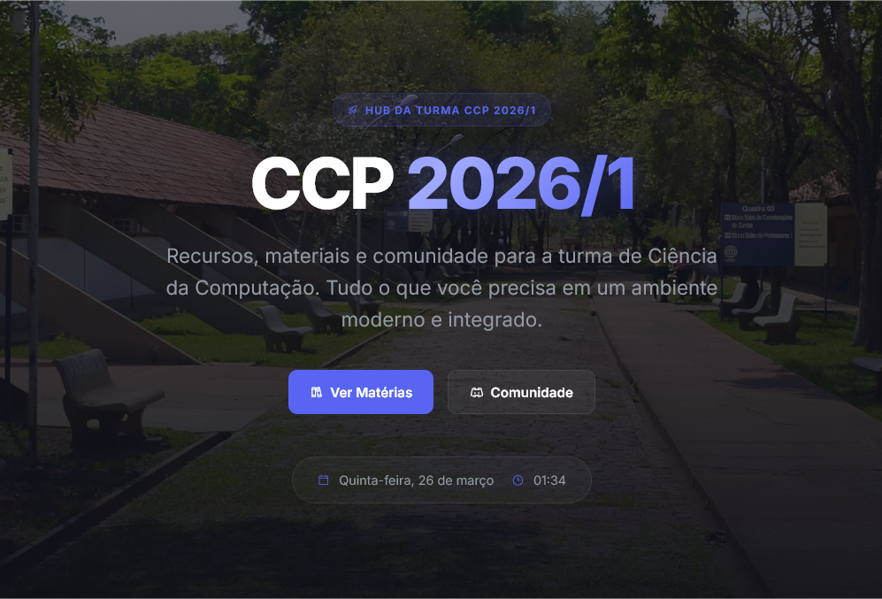

<p align="center">
  
</p>

<p align="center">
  
  
  
  
</p>

O **Hub Central** é o portal oficial da turma **CCP 2026/1 - Barra do Garças**, criado para reunir em um só lugar **horários, materiais acadêmicos, avisos, links úteis e espaços da comunidade**.

A proposta do projeto é simples: **centralizar a vida acadêmica da turma em uma interface moderna, prática e acessível**, reduzindo a desorganização e facilitando o acesso rápido às informações importantes do dia a dia.

---

## 🌐 Acessar o Projeto

O portal está disponível online e pode ser acessado diretamente pelo navegador:

🔗 **[Acessar o Hub Central](https://ccpbag2026.vercel.app/)**

<p align="center">
  
</p>

---

## 🎯 Objetivo

O projeto nasceu da necessidade de concentrar informações importantes da turma em um único ambiente digital.

Em vez de depender de mensagens perdidas em grupos, links espalhados ou arquivos soltos, o **Hub Central** funciona como um ponto central de acesso para a rotina acadêmica, tornando a experiência dos alunos mais organizada, rápida e eficiente.

---

## ✨ Funcionalidades

### 📅 Organização Acadêmica
- **Horário Dinâmico** com destaque automático para o dia atual
- **Materiais Acadêmicos** organizados por semestre e disciplina

### 📢 Comunicação
- **Mural de Avisos** para recados e informações importantes
- Sistema de **“Saiba Mais”** para exibir detalhes adicionais

### 🌐 Comunidade
- Acesso rápido aos **grupos de WhatsApp**
- Link para o **servidor do Discord**

### 🔗 Utilidades
- **Links úteis** e ferramentas institucionais

### 🛠️ Administração
- **Painel Administrativo (oculto)** para auxiliar na geração de novos blocos de conteúdo para o `data.json`

---

## 🧱 Tecnologias Utilizadas

- **HTML5**
- **CSS3**
- **JavaScript (Vanilla)**
- **JSON**

---

## 📝 Como Atualizar o Conteúdo

Grande parte das informações exibidas no portal é controlada pelo arquivo `data.json`.

Por meio dele, é possível atualizar:

- horários das aulas,
- avisos,
- materiais acadêmicos,
- links úteis,
- informações da comunidade.

> ⚠️ **Importante:** mantenha a estrutura do JSON correta para evitar erros de carregamento no portal.

Para facilitar a criação de novos blocos, o projeto também conta com a ferramenta auxiliar:

- `admin_panel.html`

---

## 📚 Como Contribuir com Materiais

Você **não precisa saber programar** para ajudar no Hub Central.

Se quiser contribuir com:

- resumos,
- PDFs,
- listas de exercícios,
- anotações,
- links úteis,
- materiais de disciplinas,

basta enviar o conteúdo pelo **Discord oficial da turma**:

🎮 **[Entrar no Discord](https://discord.gg/fbuqySuePN)**

Após o envio, alguém responsável pela manutenção do site irá revisar e adicionar o conteúdo ao portal.

---

## 🛠️ Como Contribuir com o Projeto

Se você deseja contribuir diretamente com o código, layout ou estrutura do Hub Central, siga os passos abaixo:

1. Faça um **Fork** do projeto
2. Crie uma **Branch** para sua funcionalidade:

```bash
git checkout -b feature/nova-funcionalidade
```

3. Faça o **Commit** das alterações:

```bash
git commit -m "Adiciona nova funcionalidade"
```

4. Faça o **Push** para sua branch:

```bash
git push origin feature/nova-funcionalidade
```

5. Abra um **Pull Request**

Toda contribuição é bem-vinda — seja para corrigir bugs, melhorar a interface, organizar a estrutura ou adicionar novas funcionalidades.

---

## 📁 Estrutura do Projeto

```bash
/
├── index.html          # Estrutura principal do portal
├── style.css           # Estilização e layout visual
├── script.js           # Lógica dinâmica e interatividade
├── data.json           # Base de dados do portal
├── admin_panel.html    # Ferramenta auxiliar para geração de conteúdo
└── README.md           # Documentação do projeto
```

## 🤝 Sobre a Proposta

O **Hub Central** é um projeto pensado para ser **útil, colaborativo e evolutivo**.

Mais do que um site, a ideia é construir uma plataforma que acompanhe a rotina da turma e se torne um espaço central de apoio acadêmico e comunitário ao longo do curso.

---

## 👨‍💻 Créditos

Projeto desenvolvido para a turma **CCP 2026/1 - Barra do Garças**.

Feito com ❤️ pela turma.
